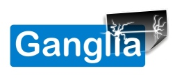

:date: 2011-12-13

.. _global-infrastructure-ecosystem:

========================
Infrastructure ecosystem
========================

.. include:: manticore-links.rst

Communication
=============

- | https://blog.example.net/
  | Company-wide Weblog

Tools
=====

Project management and issue tracking
=====================================

- | https://trac.example.net/
  | trac_ - Integrated SCM & Project Management

- | https://jira.example.net/
  | JIRA_ - Issue and project tracking

Source code management
----------------------

- | https://gitlab.example.net/
  | Company-wide GitLab_ installation

- | https://gitorious.example.net/
  | Company-wide Gitorious_ installation

- | https://github.example.net/
  | Company-wide `Github Enterprise`_ installation

.. image:: ../_static/img/logo/subversion.jpg
    :height: 50 px
    :class: imgfloatleft

- | https://svn.example.net/
  | Company-wide Subversion_ installation

Code review
-----------

.. image:: ../_static/img/logo/gerrit.png
    :height: 50 px
    :class: imgfloatleft

- | https://gerrit.example.net/
  | Gerrit_ - Web based code review and project management for Git based projects

- | https://fisheye.example.net/
  | FishEye_ - Search, track, and visualize code changes

Package repositories
--------------------

.. image:: ../_static/img/logo/python.png
    :height: 50 px
    :class: imgfloatleft

- | http://pypi.example.net/
  | Python: devpi_: PyPI_ server and packaging/testing/release tool

- | http://nexus.example.net/
  | Java: `Sonatype Nexus`_ - artifact- and repository-management

QA - Code quality
=================

Continuous integration
----------------------

- | https://hudson.example.net/
  | `Hudson CI`_ - Extensible continuous integration server

Code metrics
------------

- | http://sonar.example.net/
  | SonarQube_ - open platform to manage code quality

Monitoring
==========

- | https://monitor.example.net/ganglia/
  | `Ganglia Monitoring System`_ - Monitoring clusters and Grids since the year 2000

Documentation
=============

- | https://wiki.example.net/
  | Confluence_ - Content Creation, Collaboration & Knowledge Sharing for Teams

Development servers
===================

- http://development.example.net/
- http://build.example.net/
