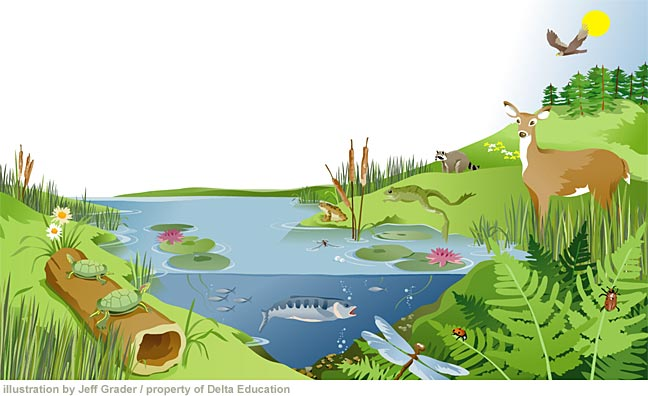
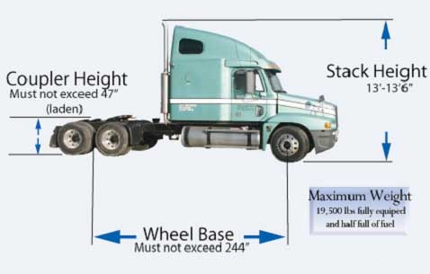

:orphan:

===============================
Manticore documentation project
===============================

.. Indices and tables
.. ==================

.. include:: global/manticore-links.rst

----

- | :ref:`global-getting-started`
  | - How to get started with your development environment...
  | - Learn about our server infrastructure...

- | :ref:`global-specifications`
  | Some specification documents.
  |

- | :ref:`global-overview`
  | Entrypoint to the collection of documentation
  | spread across multiple project repositories.

- | :ref:`global-glossary`
  | Acronyms and stuff.
  |
  |

----

- | :ref:`manticore-latest-edits`
  | List of most recently edited documents in reverse
  | chronological order aka. Blog, Feed, Activity Stream.

.. image:: _static/img/icon/changes-film.png
    :width: 75 px
    :class: imgfloatleft

- | :doc:`summary/changes`
  | Aggregated release notes across all projects' ``CHANGES.rst``
  | in reverse chronological order as an activity stream.

- | :doc:`summary/statistics`
  | Repository statistics generated by gitstats_ and StatSVN_.
  |

----

- | :ref:`global-infrastructure-ecosystem`
  | Pointers to various web-based tools,
  | management interfaces and servers.

About
-----

- | :ref:`manticore-readme`
  | About how to :ref:`manticore-add-content` to the documentation
  | and how to :ref:`manticore-generate-content`.
- :ref:`manticore-changes`

.. * :ref:`genindex`
.. * :ref:`modindex`
.. * :ref:`search`
.. * :ref:`glossary`
